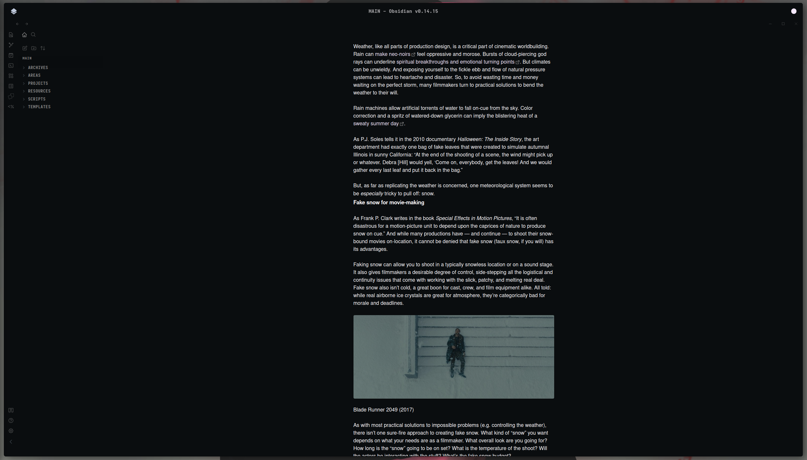

# SAGA for Obsidian

A dark theme for [Obsidian](https://obsidian.md).

  

## Installation
1. `wget https://raw.githubusercontent.com/SAGAtheme/Obsidian/master/SAGA.css`  
2. Move the css file into your vault's .obsidian/themes/ folder and enable it in Obsidian. 

## Notes
- This theme is a recolour of the beautiful Minimal theme. You can find it [here](https://github.com/kepano/obsidian-minimal).  

## License

[MIT License](./LICENSE)

